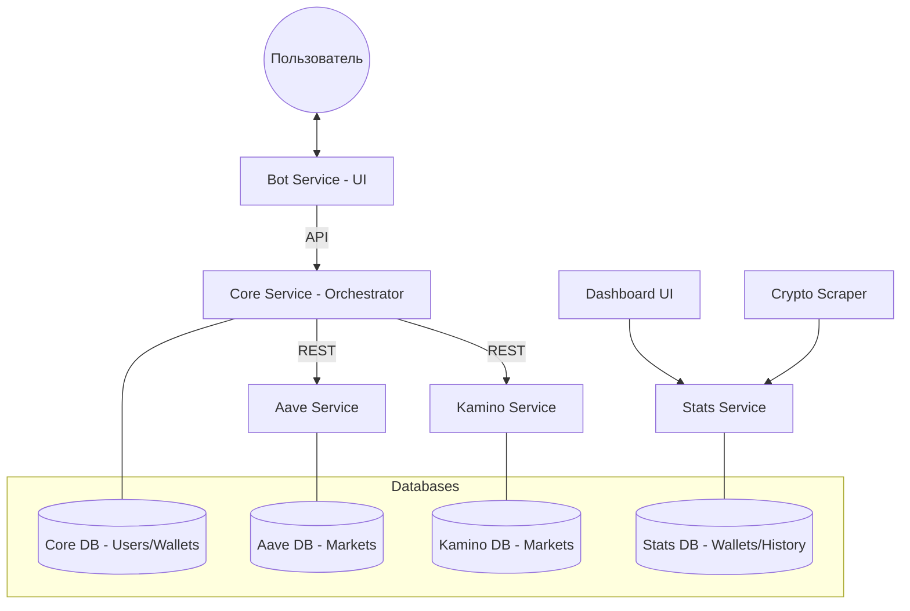

# LTV Watch Bot - Microservices Architecture

Система мониторинга Health Factor (HF) и Loan-to-Value (LTV) для протоколов Kamino (Solana) и Aave (Ethereum, Arbitrum, Base).

## Архитектура

Проект разделен на 6 независимых микросервисов и 1 UI-приложение. Каждый backend-сервис имеет свою базу данных PostgreSQL и общается по REST API.



- **Bot Service**: Тонкий клиент для Telegram. Отвечает за отрисовку меню и сессии пользователей.
- **Core Service**: Центральный узел. Управляет пользователями, кошельками и настройками. Оркестрирует запросы к протоколам.
- **Aave Service**: Взаимодействие со смарт-контрактами Aave V3.
- **Kamino Service**: Взаимодействие с API/RPC Kamino Finance.
- **Stats Service**: Хранилище истории цен и API для дашборда.
- **Crypto Scraper**: Скрейпинг публичных источников (DeBank, Jupiter, Blockchair, Tronscan) и отправка данных в Stats.
- **Dashboard UI**: PWA интерфейс для визуализации истории и общей суммы.

---

## Локальный запуск

### Вариант 1: Docker Compose (Рекомендуется)

Самый быстрый способ запустить всю систему со всеми зависимостями.

1.  Скопируйте пример окружения:
    ```bash
    cp .env.example .env
    ```
2.  Отредактируйте `.env`, вставив ваш `BOT_TOKEN` (получите у @BotFather).
3.  Запустите контейнеры:
    ```bash
    npm run docker:up
    ```
4.  Дашборд будет доступен на `http://localhost:3004`.

### Вариант 2: Без Docker

Для отладки конкретных сервисов.

1.  Установите зависимости в корне и во всех папках `services/*`:
    ```bash
    npm install
    # И для каждого сервиса:
    cd services/bot && npm install
    # ... и так далее
    ```
2.  Убедитесь, что у вас установлен Go (1.22+) и запущен PostgreSQL.
3.  Настройте переменные окружения в `.env` (см. `.env.example`).
4.  Запустите все сервисы одной командой из корня:
    ```bash
    npm run dev:all
    ```
5.  Дополнительно запустите:
    ```bash
    npm run dev:stats
    npm run dev:dashboard
    npm run dev:scraper
    ```

---

## Деплой в Railway

Railway не поддерживает `docker-compose.yml` напрямую, поэтому каждый сервис настраивается отдельно.

### Шаг 1: База данных
1.  Создайте новый проект в Railway и добавьте **PostgreSQL**.
2.  В консоли Postgres (вкладка Data -> Query) создайте 3 базы данных:
    ```sql
    CREATE DATABASE core_db;
    CREATE DATABASE aave_db;
    CREATE DATABASE kamino_db;
    CREATE DATABASE stats_db;
    ```

### Шаг 2: Создание сервисов
Для каждого сервиса (`core`, `bot`, `aave`, `kamino`, `stats`, `crypto-scraper`, `dashboard`):
1.  Нажмите **New** -> **GitHub Repo** и выберите этот репозиторий.
2.  В настройках сервиса (**Settings**) укажите **Root Directory**:
    - `services/core`
    - `services/bot`
    - `services/aave`
    - `services/kamino`
    - `services/stats`
    - `services/crypto-scraper`
    - `services/dashboard`
3.  Включите **Private Networking** в разделе Networking для каждого сервиса.

### Шаг 3: Переменные окружения (Variables)

| Сервис | Переменная | Значение (пример) |
| :--- | :--- | :--- |
| **core** | `DATABASE_URL` | `${{Postgres.DATABASE_URL}}core_db` |
| | `AAVE_SERVICE_URL` | `http://aave.railway.internal:3001` |
| | `KAMINO_SERVICE_URL` | `http://kamino.railway.internal:3002` |
| **bot** | `CORE_SERVICE_URL` | `http://core.railway.internal:3000` |
| | `BOT_TOKEN` | `ваш_токен` |
| **aave** | `DATABASE_URL` | `${{Postgres.DATABASE_URL}}aave_db` |
| **kamino** | `DATABASE_URL` | `${{Postgres.DATABASE_URL}}kamino_db` |
| **stats** | `DATABASE_URL` | `${{Postgres.DATABASE_URL}}stats_db` |
| | `PORT` | `3003` |
| **dashboard** | `VITE_STATS_API_URL` | `http://stats.railway.internal:3003` |
| **crypto-scraper** | `STATS_SERVICE_URL` | `http://stats.railway.internal:3003` |
| | `HEADLESS` | `false` |

---

## База данных и миграции

Миграции реализованы на чистом SQL и применяются **автоматически** при старте каждого сервиса.

- Файлы миграций находятся в `services/*/migrations/`.
- Система ведет учет примененных файлов в таблице `_migrations`.
- Чтобы изменить структуру базы, просто добавьте новый `.sql` файл в соответствующую папку.

---

## Команды бота

- `/menu` — Открыть главное интерактивное меню.
- `/add <wallet>` — Добавить кошелек (протокол определится автоматически).
- `/settings` — Просмотр текущих порогов Warning/Danger для обоих протоколов.
- `/check` — Мгновенная проверка всех позиций.
